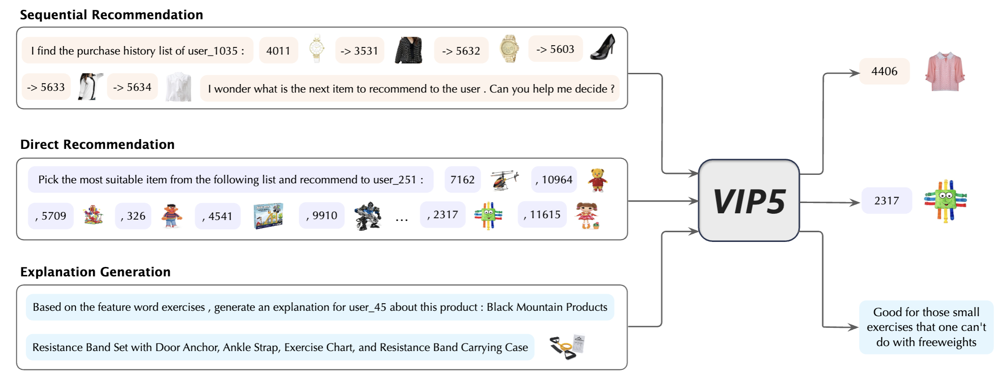

# VIP5
VIP5: Towards Multimodal Foundation Models for Recommendation



## Dependencies: 
- PyTorch 1.12
- transformers
- tqdm
- numpy
- sentencepiece
- pyyaml
- pip install git+https://github.com/openai/CLIP.git

## Usage

1. Clone this repo

2. Download preprocessed data and image features from this [Google Drive link](https://drive.google.com/drive/u/1/folders/1AjM8Gx4A3xo8seYFWwNUBHpM9uRbfydR), then unzip them into the *data* and *features* folders

   
3. Create *snap* and *log* folders to store VIP5 checkpoints and training logs:
    ```
    mkdir snap log
    ```

4. Conduct parameter-efficient tuning with scripts in *scripts* folder, such as

    ```
    CUDA_VISIBLE_DEVICES=0,1,2,3 bash scripts/train_VIP5.sh 4 toys 13579 vitb32 2 8 20
    ```

## Citation

Please cite the following paper corresponding to the repository:
```
@inproceedings{geng2023vip5,
  title={VIP5: Towards Multimodal Foundation Models for Recommendation},
  author={Geng, Shijie and Tan, Juntao and Liu, Shuchang and Fu, Zuohui and Zhang, Yongfeng},
  booktitle={Findings of the Association for Computational Linguistics: EMNLP 2023},
  year={2023}
}
```

## Acknowledgements

[P5](https://github.com/jeykigung/P5), [VL-T5](https://github.com/j-min/VL-T5), [PETER](https://github.com/lileipisces/PETER), and [S3-Rec](https://github.com/aHuiWang/CIKM2020-S3Rec)
